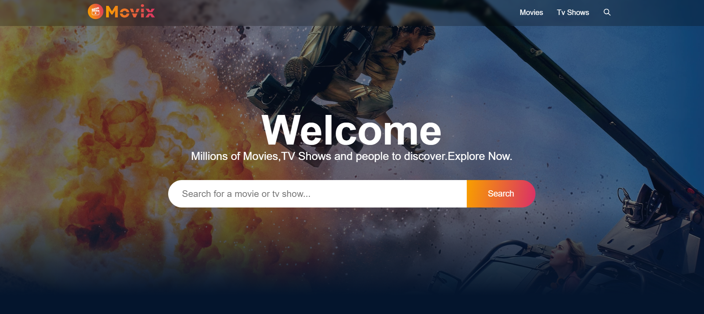

# Movix

Movix is a responsive movie discovery platform built using React and SCSS.

## Features

- **Dynamic Hero Image**: Showcase dynamically changing hero images for the latest blockbuster hits and upcoming releases.
- **Search Feature**: Find movies easily with our powerful search feature, allowing filtering by genre, release year, or cast.
- **Infinite Scroll**: Seamlessly browse through our vast movie collection with infinite scrolling.
- **Explore Pages**: Dive deep into specific genres, curated collections, or discover hidden gems with dedicated explore pages.
- **Trending Section**: Stay updated with the latest trends in the movie world with our trending section.
- **Rating**: View user and critic ratings for each movie and contribute your own ratings.
- **Trailers & Video Clips**: Watch trailers and video clips for most movies to get a sneak peek of the action.
- **Official Cast**: Explore detailed profiles and filmographies of the official cast members.

## Technologies Used

- **React**: JavaScript library for building user interfaces.
- **SCSS**: CSS preprocessor for styling.
- **Redux**: State management library.
- **Axios**: HTTP client for making API requests.
- **React Router**: Routing library for React applications.

## Screenshot

## Live Demo

Check out the live demo [here](https://movix-smith.netlify.app/).

## Getting Started

1. **Clone the repository**:
   git clone https://github.com/soumyajoypal/movix-website

2. **Install dependencies**:
   cd movix
   npm install

3. **Run the development server**:
   npm start

4. **Open your browser**:
   Visit `http://localhost:5173` to view the Movix website.

## Author

Soumyajoy Pal
